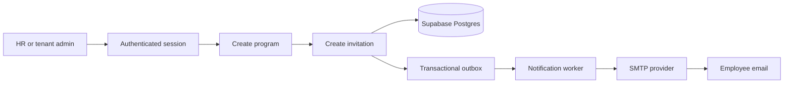
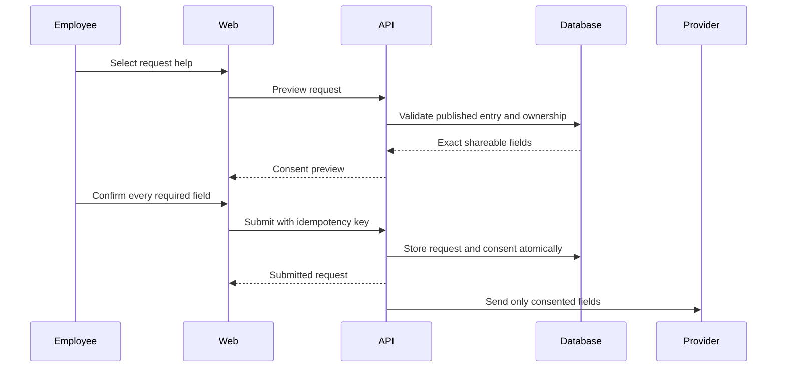

# Relo Platform Features and End-to-End User Flows

## 1. Product purpose

Relo is a secure relocation platform for companies, HR teams, employees, reviewers, service providers, and platform operators.

The platform helps an employee move from invitation to successful relocation through:

- Secure account activation
- A personalized relocation case
- A guided checklist
- Destination discovery
- Saved recommendations
- Consent-based provider requests
- Notifications and reminders
- Profile, privacy, and account settings
- HR and reviewer operations
- Platform administration
- Funnel and business reporting

The product is mobile-first and must work well at a 375px viewport. Web, API, and worker services are separate deployable units. Supabase Auth and PostgreSQL provide identity, persistence, and row-level security.

## 2. Product principles

- A user sees only the data permitted by their authenticated identity, membership, tenant, and role.
- HR and administrator accounts are created through controlled administrative or database workflows. They cannot self-register through the public portal.
- Email OTP is the primary authentication method. Google OAuth is supported through Supabase Auth.
- Every dashboard requires authentication and appropriate authorization.
- Provider contact is never shared before an employee explicitly submits a consented request.
- Every retry-sensitive mutation is idempotent.
- Important mutations create an auditable domain event and transactional outbox record.
- Directory content is shown only when it is published, active, destination-relevant, and not expired.
- Suspended or revoked memberships lose access on the next protected request.
- User-facing copy is clear, calm, mobile-friendly, and free of em dashes.

## 3. Roles and permissions

| Role | Main responsibilities | Access boundary |
|---|---|---|
| Employee | Complete relocation journey, manage profile, discover services, submit requests | Own profile, case, checklist, shortlist, requests, notifications, and preferences |
| HR | Manage employees, invitations, programs, relocation progress, and operational requests | Assigned tenant only |
| Reviewer | Moderate directory content, approve publication, manage review queues | Assigned review scope and tenant/content scope |
| Tenant admin | Manage tenant users, tenant settings, and tenant operations | One tenant or explicitly assigned tenants |
| Platform admin | Manage tenants, platform health, security, feature flags, and global settings | Platform scope, not tenant employee data by default |
| Provider | Future provider-facing request handling | Only explicitly submitted and accepted provider requests |

The UI must never infer role from client-side state alone. The API resolves identity, active memberships, tenant status, role permissions, and platform scope. Supabase RLS provides a second enforcement boundary.

## 4. Feature catalog

### 4.1 Identity and access

- Email OTP request and verification
- Google OAuth sign-in
- Email-bound invitation acceptance
- Expiring, one-time invitation tokens
- Session refresh, logout, and expiry handling
- Protected routes and deep-link restoration
- Role-based access control
- Tenant selection where a user has multiple memberships
- Suspended and revoked membership handling
- Audit trail for authentication and membership events
- Public privacy, terms, and service-status pages
- No public HR or admin registration

### 4.2 Employee relocation journey

- Employee activation from an invitation
- Relocation profile and destination
- Relocation case overview
- Progress percentage derived from checklist state
- Guided checklist with due dates and completion history
- Destination directory search
- Category and text filters
- Published, non-expired, destination-scoped recommendations
- Shortlist or saved recommendations
- Provider request preview
- Field-level consent before provider submission
- Provider request tracking and withdrawal
- In-app notification inbox
- Email notification preferences
- Privacy preferences
- Session management
- Data export request
- Account deactivation request

### 4.3 HR and operations

- Create and manage relocation programs
- Create or update program versions
- Invite employees by email
- Resend and revoke invitations
- Track invitation state
- View employee activation and relocation progress
- View checklist completion and stale cases
- Manage tenant employee records
- Review incoming provider requests
- Manage operational settings
- Manage tenant notification defaults
- View operational dashboards and exception queues

### 4.4 Directory and content review

- Cities and destination taxonomy
- Provider records
- Directory entries
- Source URL and provenance metadata
- Content revisions
- Reviewer assignment
- Review, approve, reject, and request changes
- Publish and unpublish content
- Expiry dates and stale-content handling
- Moderation decisions and audit history

### 4.5 Notifications and background processing

- In-app notification creation
- Email delivery through configured SMTP
- Delivery status and retry tracking
- Deduplication keys
- Notification preference enforcement
- Checklist reminders
- Invitation reminders
- Provider request status notifications
- Outbox event processing
- Retry with backoff
- Dead-letter or failed-delivery visibility

### 4.6 Platform administration

- Tenant creation and lifecycle management
- Tenant suspension and reactivation
- Platform user and role management
- Feature flags
- Service health and readiness
- Audit log access
- Security configuration
- Operational incidents
- AARRR reporting

### 4.7 AARRR measurement

The platform tracks:

- Acquisition: invitations sent, landing visits, source, campaign, and referral attribution
- Activation: invitation accepted, OTP verified, profile completed, first checklist action
- Retention: weekly active employees, checklist return rate, notification engagement, repeat discovery
- Referral: employee referrals, invitation referrals, share actions, and successful referred activations
- Revenue: active tenants, paid programs, conversion, provider request value, and subscription metrics

Metrics are generated from durable domain events and stored in daily projections. Reports must identify the metric definition, time window, tenant scope, and data freshness.

## 5. End-to-end user flows

## Flow A: HR creates a relocation program and invites an employee

**Actor:** HR or tenant admin

1. HR signs in with an existing authorized account using email OTP or Google OAuth.
2. The API validates the session, active membership, tenant status, and HR permission.
3. HR opens Programs and selects Create program.
4. HR enters program name, destination, move window, default checklist template, and notification defaults.
5. The API validates the input and creates the program and version in one transaction.
6. The system records `ProgramCreated` and `ProgramVersionPublished` or `ProgramVersionDrafted`.
7. HR opens the employee invitation form.
8. HR enters the employee email, destination, move date, and optional message.
9. The API normalizes the email, creates a one-time hashed invitation token, and stores its expiry.
10. The system records `InvitationCreated` and creates an outbox email event.
11. The worker sends the invitation email through SMTP.
12. The HR dashboard shows the invitation as Pending.
13. If the email send fails, the invitation remains visible, the delivery is retried, and no duplicate invitation is created for the same active invitation request.

## Flow B: Employee accepts an invitation and activates an account

**Actor:** Invited employee

1. The employee opens the invitation link.
2. The frontend validates that the token is present and preserves the intended destination.
3. The API checks the hashed token, expiry, invitation email, tenant status, and invitation state.
4. The employee enters the invited email address.
5. The employee requests an email OTP.
6. Supabase Auth sends the OTP through configured SMTP without allowing public account creation.
7. The employee enters the OTP.
8. Supabase verifies the OTP and returns a session.
9. The API confirms that the authenticated email matches the invitation email.
10. The API creates or activates the employee membership and relocation case in a transaction.
11. Default checklist items are created from the selected program version.
12. The invitation is marked accepted and cannot be reused.
13. The system records `InvitationAccepted`, `MembershipActivated`, and `RelocationCaseActivated`.
14. The employee is redirected to the original invitation destination or employee home.
15. The employee sees only their own relocation case.

Failure states:

- Expired token: show a safe expiration message and provide a request-support action.
- Reused token: show that the invitation has already been handled.
- Email mismatch: stop activation without revealing account details.
- Suspended tenant: deny activation and record the attempt.
- Invalid OTP: show a retryable error without exposing provider details.

## Flow C: Employee signs in later and restores a deep link

1. The employee opens a protected URL such as `/app/checklist` while signed out.
2. The route guard stores only the safe relative return path.
3. The employee enters their email and requests an OTP.
4. The employee verifies the OTP.
5. The API returns the authenticated identity and active authorization context.
6. The frontend checks that the identity has employee access.
7. The employee is returned to `/app/checklist`.
8. The page loads data only after the authenticated session is available.

The return path must never permit an external redirect or bypass a permission check.

## Flow D: Employee completes a relocation checklist item

1. The employee opens Employee Home or My Checklist.
2. The API loads the employee-owned case and checklist items.
3. The UI shows progress, overdue items, the next recommended action, and completion state.
4. The employee selects Complete on an item.
5. The frontend sends `PATCH /api/v1/me/relocation/checklist/:itemId` with an `Idempotency-Key`.
6. The API validates the state transition and confirms that the item belongs to the employee's case.
7. The API updates the item and calculates progress from completed rows.
8. The API writes the checklist update and outbox event atomically.
9. The response returns the updated item and progress summary.
10. The UI invalidates only the employee case and checklist queries.
11. A status message confirms that the item was saved.
12. A repeated request with the same key returns the original result and creates no duplicate event.

Reopening an item clears `completed_at`, updates progress, and records a separate state transition.

## Flow E: Employee explores destination content

1. The employee opens Explore.
2. The frontend requests the employee's destination city and current filters.
3. The API returns only entries that are published, active, non-expired, and relevant to the destination.
4. The employee searches by phrase or selects a category.
5. The API normalizes the query, caps page size, and returns a paginated result.
6. The employee opens a directory card to view description, source, provenance, and provider contact policy.
7. The employee can save the item to their shortlist.
8. Saving is idempotent and creates one `DirectoryEntrySaved` event only on the first state change.
9. If content expires or is unpublished, it disappears from active recommendations while saved history remains auditable.

## Flow F: Employee submits a consent-based provider request

1. The employee opens a valid directory entry.
2. The employee selects Request help.
3. The API validates that the entry is still published and not expired.
4. The API returns a request preview showing the provider destination and exact fields that will be shared.
5. The employee reviews field-level consent checkboxes.
6. The submit button remains disabled until all required fields are explicitly consented.
7. The employee submits the request with an idempotency key.
8. The API rechecks publication state, employee ownership, and consent.
9. The API creates the provider request and consent snapshot in one transaction.
10. The system records `ProviderRequestSubmitted` and creates a notification outbox event.
11. The employee sees the request as Submitted in Requests.
12. The provider receives only the submitted fields through the approved provider channel.
13. If the employee withdraws consent, the API records `ConsentWithdrawn` and `ProviderRequestWithdrawn` without deleting history.
14. A new request cannot be created from a withdrawn request unless the employee completes a new consent flow.

## Flow G: Employee receives and manages notifications

1. A domain event creates an outbox notification job.
2. The worker claims the job with a lease.
3. The worker checks notification preferences and dedupe key.
4. The worker creates an in-app notification.
5. If email is enabled, the worker sends email through SMTP.
6. Delivery status is recorded as pending, delivered, retrying, or failed.
7. A failed email remains visible in the in-app inbox.
8. Retry attempts use the same dedupe key and never create duplicate visible notifications.
9. The employee opens Notifications and marks an item read.
10. The employee can update email, in-app, reminder, and timezone preferences.

## Flow H: Employee manages profile, privacy, and account settings

1. The employee opens Profile or Settings.
2. The API returns only the authenticated employee's profile and preferences.
3. The employee updates profile fields such as name, phone, move date, or destination details.
4. The API validates and persists only allowed fields.
5. The employee updates privacy settings such as contact sharing and provider visibility.
6. The employee reviews active sessions and signs out of the current session or requests broader revocation.
7. The employee requests a data export.
8. The API creates an export job and returns a status identifier.
9. The worker prepares the export without exposing data to another user.
10. The employee requests deactivation.
11. The platform shows the consequences and requires confirmation.
12. The account is deactivated without deleting required audit history.

## Flow I: HR monitors employee progress

1. HR signs in and selects an authorized tenant context.
2. The dashboard shows activation count, active relocations, checklist progress, overdue items, and request status.
3. HR filters by program, destination, employee state, and date range.
4. The API applies tenant and role authorization before querying data.
5. HR opens an employee record and sees only permitted operational fields.
6. HR can resend or revoke an invitation, subject to permission.
7. HR can view progress but cannot silently change employee consent.
8. Any administrative change creates an audit entry.

## Flow J: Reviewer moderates and publishes content

1. A reviewer signs in and opens the review queue.
2. The API returns content within the reviewer's permitted scope.
3. The reviewer opens a draft or revision and sees source and provenance details.
4. The reviewer chooses Approve, Reject, Request changes, Publish, or Unpublish.
5. The API validates the transition and records the reviewer, decision, reason, and timestamp.
6. Published content becomes available only when its city, provider, status, and expiry conditions are valid.
7. Unpublished or expired content is removed from active employee search results.
8. Employees who previously saved the entry retain an auditable saved record, but cannot submit a new request from invalid content.

## Flow K: Tenant admin manages tenant access

1. A tenant admin signs in.
2. The UI shows tenant-level Users, Events, and Settings only.
3. The admin creates or updates a tenant employee record through an authorized workflow.
4. The admin cannot grant platform-admin permissions.
5. The API writes the membership change and audit event.
6. A revoked or suspended membership loses access on the next protected API request.
7. Tenant data remains isolated from all other tenants.

## Flow L: Platform admin manages the platform

1. A platform admin signs in through a pre-created account.
2. The API returns platform scope and platform permissions.
3. The UI shows Tenants, Health, Security, Feature Flags, Audit, and platform Settings.
4. The admin creates, suspends, or reactivates a tenant.
5. The admin manages platform-level roles and security settings.
6. The admin views service health, readiness, incident state, and key operational metrics.
7. The admin reviews AARRR metrics across tenants or within a selected tenant scope.
8. Sensitive actions require explicit confirmation and are audited.

## Flow M: AARRR and revenue reporting

1. Domain services emit durable events for invitations, activation, checklist activity, discovery, referrals, requests, and billing-related actions.
2. The outbox stores events transactionally with the source mutation.
3. The worker claims and deduplicates events.
4. Projection handlers update daily AARRR and tenant progress tables.
5. Admin or authorized HR users select a metric, date range, tenant scope, and timezone.
6. The API returns a report with values, definition, freshness, and filters.
7. Authorized users can create an export job.
8. The worker generates the export and marks it ready or failed.
9. The export is available only to the requesting authorized scope and expires according to policy.

## 6. Route map

### Public routes

- `/`
- `/login`
- `/auth/verify`
- `/auth/callback`
- `/invite/:token`
- `/oauth/consent`
- `/privacy`
- `/terms`
- `/status`

### Employee routes

- `/app`
- `/app/checklist`
- `/app/explore`
- `/app/saved`
- `/app/requests`
- `/app/notifications`
- `/app/profile`
- `/app/settings`

### HR and tenant routes

- `/hr`
- `/hr/programs`
- `/hr/employees`
- `/hr/invitations`
- `/hr/requests`
- `/hr/reports`
- `/admin`
- `/admin/users`
- `/admin/settings`

### Reviewer routes

- `/review`
- `/review/queue`
- `/review/content/:id`
- `/review/settings`

### Platform routes

- `/platform/tenants`
- `/platform/health`
- `/platform/audit`
- `/platform/security`
- `/platform/feature-flags`

## 7. API groups

### Identity and authorization

- `POST /api/v1/auth/otp/request`
- `POST /api/v1/auth/otp/verify`
- `GET /api/v1/auth/google/start`
- `GET /api/v1/auth/me`
- `POST /api/v1/auth/logout`
- `GET /api/v1/oauth/consent/details`
- `POST /api/v1/oauth/consent/approve`
- `POST /api/v1/oauth/consent/deny`

### Employee journey

- `GET /api/v1/me/relocation`
- `GET /api/v1/me/relocation/checklist`
- `PATCH /api/v1/me/relocation/checklist/:itemId`
- `GET /api/v1/directory`
- `GET /api/v1/directory/:entryId`
- `GET /api/v1/me/shortlist`
- `POST /api/v1/me/shortlist`
- `DELETE /api/v1/me/shortlist/:entryId`
- `POST /api/v1/me/provider-requests/preview`
- `POST /api/v1/me/provider-requests`
- `GET /api/v1/me/provider-requests`
- `POST /api/v1/me/provider-requests/:id/withdraw`
- `GET /api/v1/me/notifications`
- `POST /api/v1/me/notifications/:id/read`
- `GET /api/v1/me/preferences`
- `PATCH /api/v1/me/preferences`

### Operations and reporting

- `GET /api/v1/hr/programs`
- `POST /api/v1/hr/programs`
- `POST /api/v1/hr/invitations`
- `GET /api/v1/hr/employees`
- `GET /api/v1/hr/requests`
- `GET /api/v1/review/queue`
- `POST /api/v1/review/content/:id/decision`
- `GET /api/v1/reports/aarrr`
- `POST /api/v1/reports/exports`
- `GET /api/v1/reports/exports/:id`

## 8. Cross-cutting state and error behavior

Every page and API-backed interaction must support:

- Loading state
- Empty state
- Stale data state
- Retryable error state
- Permission-denied state
- Session-expired state
- Success status announcement
- Reduced-motion behavior
- Keyboard focus preservation
- Mobile layout without horizontal scrolling

Important error cases:

| Situation | User-facing result | Security behavior |
|---|---|---|
| Missing session | Redirect to login | No protected data request is made |
| Expired session | Ask the user to sign in again | Clear local session safely |
| Missing permission | Show access unavailable | Do not reveal resource existence |
| Suspended membership | Show account access unavailable | Deny the next protected request |
| Expired directory item | Remove from active recommendations | Preserve audit and saved history |
| Missing consent | Keep submit disabled or return consent error | Do not send provider data |
| Duplicate mutation | Return original result | Do not duplicate side effects |
| Failed email delivery | Keep in-app notification visible | Retry with deduplication |
| Invalid invitation | Show safe recovery guidance | Do not expose invitation or account details |

## 9. Completion gates

### Foundation gate

- OTP and Google authentication work with configured Supabase providers.
- Invitation acceptance is email-bound, expiring, one-time, and audited.
- Every protected route requires a valid session and permitted role.
- Tenant and platform authorization boundaries are enforced in API and RLS.
- Web, API, and worker services build without credentials in the image.
- Health, readiness, logs, and graceful shutdown are verified.

### Employee gate

- An invited employee can activate and see only their relocation case.
- Checklist completion is persisted, idempotent, auditable, and reflected in progress.
- Directory search returns only valid destination content.
- Shortlist actions are idempotent.
- Provider requests require field-level consent and support withdrawal.
- Notifications and preferences work on mobile.
- Employee settings support privacy, sessions, export, and deactivation requests.

### Operations gate

- HR can manage programs, employees, invitations, and operational requests.
- Reviewers can moderate and publish content.
- Tenant admins cannot grant platform scope.
- Platform admins can manage tenants and platform health.
- AARRR metrics and exports show definitions, scope, and freshness.

### Production gate

- Outbox events are claimed, deduplicated, retried, and observable.
- Notification and projection handlers are safe to repeat.
- Security headers, rate limits, audit logs, and secret handling are verified.
- Browser, accessibility, and mobile regression tests pass.
- Render deployment verification confirms service health, gzip, readiness, and authenticated boundaries.

## 10. Current delivery status

Completed foundation work includes the service skeleton, request validation, identity and tenancy schema, OTP and Google auth flows, authorization policy, responsive authenticated web shell, Docker and Render service wiring, and the employee journey schema with RLS and fixtures.

The next implementation areas are the employee relocation and checklist API, directory and shortlist API, provider request consent flow, notification APIs, employee pages, HR operations, reviewer workflows, AARRR reporting, and production hardening.

