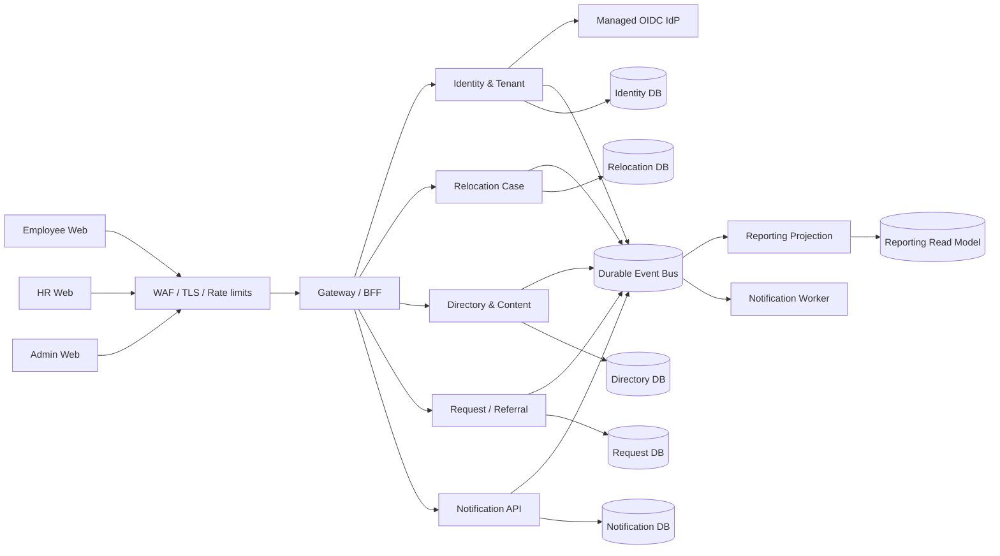
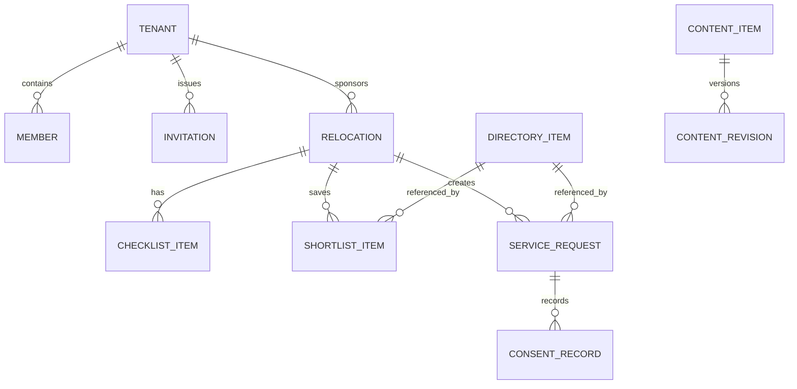
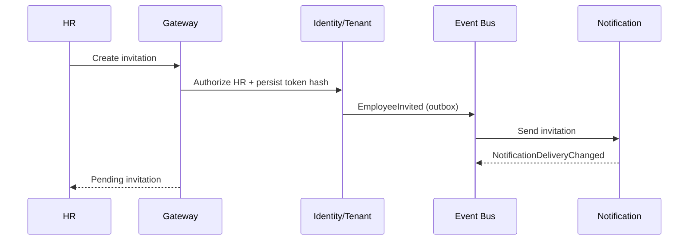
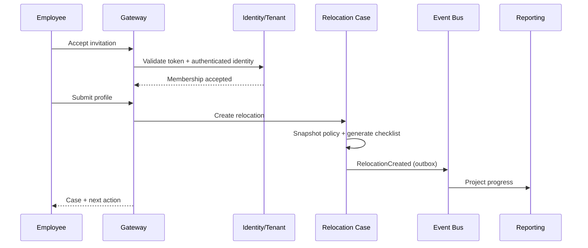
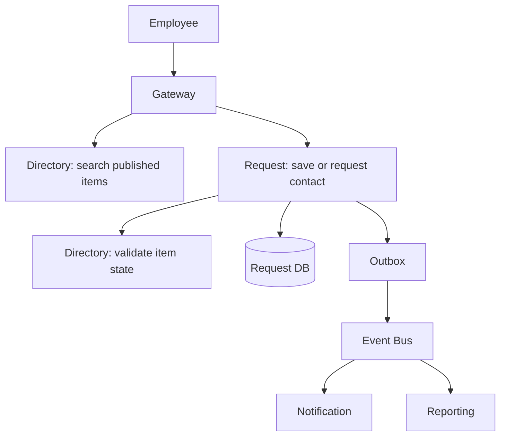

# Relo Platform Design Spec

## Priority architecture update — 28 September 2026

The first product slice prioritizes the AARRR loop: Acquisition, Activation, Retention, Referral, and Revenue. The frontend and backend are separate deployable microservices. The backend is the authority for Supabase Auth sessions, SMTP-triggered verification/reset/invitation email, database-backed RBAC, and tenant-scoped read models. The frontend only renders capabilities granted by a valid backend session; dashboards are unavailable while logged out.

The prototype now uses the Supabase project selected by the team for Postgres, Auth, RLS, profiles, relocation cases, growth events, and `growth_metrics`. AARRR metrics are seeded fixtures in the database so the team can validate the workflow before event ingestion and materialized projections are added. In production, domain events should be emitted from invitation, first-action, checklist, feedback, referral, and allowance flows and projected into tenant-scoped metrics.

## Mission

Build a secure B2B relocation onboarding platform that gives transferred employees one employer-endorsed place to prepare for a move, discover trusted local options, track next steps, and request help while giving HR a repeatable, low-touch operating surface.

## Current Context

- **Inspected:** `PM_problem_statement.txt`, which defines Relo, the employee persona Rohan, the HR buyer persona Ananya, and the trust/coordination problem.
- **Inspected:** `.codex/agents/`, which contains role guidance for architecture, backend, frontend, security, QA, DevOps, performance, debugging, code review, and technical writing.
- **Inspected:** repository root, which currently contains the problem statement, a submission PDF, and agent guidance; no application source, deployment configuration, or existing data model was found.
- **Inferred:** Relo should be multi-tenant from the first production release because the buyer is an employer and the same platform will serve multiple companies.
- **Assumed:** V1 is a responsive web application. Native mobile applications, payments, bookings, lease execution, and provider payouts are deferred.
- **Open:** final cloud provider, identity vendor, and compliance target must be selected before implementation begins.

## Goals

- Give an invited employee a useful, personalized relocation workspace quickly.
- Make recommendations trustworthy through provenance, freshness, moderation, and clear disclosures.
- Reduce HR back-and-forth through configurable programs, checklists, reminders, and progress views.
- Isolate employer tenants and protect employee privacy by default.
- Use loose coupling: independently deployable services, owned data, stable APIs, and durable asynchronous events.
- Keep V1 operable by a small team through managed infrastructure and a deliberately small service set.
- Make the architecture evolvable toward richer provider integrations, search, and transactions without committing to them now.

## Non-Goals

- Payment processing, commissions, provider payouts, escrow, or billing automation.
- Lease signing, legal advice, property verification, or a guarantee of housing/provider quality.
- A public consumer marketplace or employee self-service signup without employer sponsorship.
- Native iOS/Android apps.
- Real-time chat between employees and providers.
- A general-purpose HRIS replacement.
- Advanced recommendation ML; V1 uses explicit preferences, tenant program rules, and curated content.

## Users / Stakeholders

- **Employee:** invited transferee preparing for a city move; values trust, low effort, privacy, and timely next actions.
- **HR / Talent Mobility:** configures programs, invites employees, monitors progress, and handles exceptions.
- **Content reviewer:** validates and publishes city/provider content.
- **Platform operator:** manages tenants, incidents, delivery failures, and audit access.
- **Provider or referral recipient:** receives only the information explicitly consented to by the employee, if this integration is enabled.

## Assumptions

- Employer tenants own the employee relationship and authorize the platform to process relocation data for onboarding operations.
- The initial product is English-first with timezone-aware dates; localization is a later workstream.
- The platform uses a managed OIDC provider rather than storing passwords.
- The initial directory is curated or imported through an internal workflow; public provider self-service is deferred.
- Content and provider data have a provenance source, verification state, reviewer, and expiry/freshness metadata.
- The team can operate a managed container runtime, a managed PostgreSQL service, object storage if later needed, a durable message bus, secrets management, and centralized telemetry.

## Proposed V1

### Employee capabilities

- Accept an employer invitation.
- Complete a minimal relocation profile.
- See an employer-configured checklist with required, recommended, optional, overdue, and blocked states.
- Browse trusted city content and providers using category and simple filters.
- Save private shortlist items.
- Submit a structured request for help or provider contact with explicit consent.
- See request status and withdraw an open request.
- Manage notification preferences and delete/withdraw optional profile data where policy permits.

### HR capabilities

- Create and version relocation programs.
- Configure destination, office, target move window, allowance, checklist template, and content categories.
- Invite, remind, revoke, or re-invite employees.
- See progress and operational exceptions through a privacy-minimized dashboard.
- View request status needed to support the employee.
- Export aggregate progress reports; exports are permissioned, logged, and time-limited.

### Content/admin capabilities

- Create draft city guides, providers, and directory items.
- Review provenance and required fields.
- Approve, reject, update, expire, unpublish, and audit content revisions.
- Prevent unapproved or expired items from employee discovery.

## Architecture / Design

### Recommendation

Use a small set of independently deployable, event-aware services. Each service owns its persistence and migrations. Synchronous REST calls handle immediate user interactions; durable events handle cross-service reactions, reporting, and notifications. Use a gateway/BFF at the edge and a managed container runtime in production.

This is intentionally not a shared-database system. A shared managed PostgreSQL cluster is acceptable for V1 cost and operations, but each service receives its own database/schema boundary, credentials, migrations, and ownership rules. Cross-service joins and foreign keys are prohibited.

### Recommended implementation stack

The stack is a recommendation, not a hard dependency. It keeps the full-stack team in one primary language while preserving clean service contracts.

| Layer | Recommendation | Reason |
|---|---|---|
| Employee/HR web | Next.js + TypeScript + TanStack Query | responsive web delivery, typed API clients, server/client rendering where useful |
| UI primitives | accessible component primitives with a small Relo token layer | consistent states without locking product design to a large theme |
| Service runtime | TypeScript + NestJS on Fastify, or Fastify with explicit modules | common language, dependency injection, validation, OpenAPI, testability |
| Validation/contracts | JSON Schema/OpenAPI plus generated clients and contract tests | makes compatibility visible at service boundaries |
| Data access | PostgreSQL with SQL migrations and a typed query layer | explicit queries, strong transactions within a service, portable ownership |
| Eventing | broker adapter with NATS JetStream as the initial implementation | durable events, consumer groups, replay, and a replaceable transport boundary |
| Jobs | dedicated worker processes consuming broker jobs/events | isolates retries and slow provider calls from user-facing requests |
| Testing | Vitest or equivalent unit tests, service integration tests, Playwright E2E | fast domain feedback plus browser-level confidence |
| Local runtime | Docker Compose with seeded dependencies | repeatable onboarding for engineers and CI |
| Production runtime | managed containers, managed PostgreSQL, managed secrets, managed telemetry | independent deploys without self-managed platform overhead |

Use one versioned contract package per boundary, not one shared domain package. Shared packages may contain infrastructure-neutral primitives such as event envelope validation, correlation-ID handling, and error serialization; they must not contain another service’s entities or repositories.

### Logical topology



### Service boundaries

| Service | Responsibilities | Owns | Key dependencies |
|---|---|---|---|
| Gateway / BFF | edge authentication context, rate limits, request shaping, employee/HR read composition | no business data | OIDC JWKS, service APIs |
| Identity & Tenant | tenant, membership, roles, invitations, policy references | tenants, members, roles, invitations | managed OIDC, event bus |
| Relocation Case | cases, policy snapshots, profile, checklist, state transitions | relocation data and checklist | Identity contract, event bus |
| Directory & Content | cities, providers, listings, guides, moderation, freshness | catalog and content revisions | event bus, optional object storage |
| Request / Referral | shortlists, consent, request workflow, status | requests and consent records | Directory contract, event bus |
| Notification | templates, preferences, delivery, retries, suppression | delivery records | email/in-app adapters, event bus |
| Reporting Projection | denormalized HR/admin read models and metrics | projections only | event bus |

### Communication decisions

| Decision | Chosen design | Alternatives considered | Rationale |
|---|---|---|---|
| External API | versioned REST/JSON behind a gateway/BFF | GraphQL, direct service exposure | easier authorization, caching, contract testing, and operational debugging for a small team |
| Cross-service reactions | durable event bus plus outbox | synchronous call chains, distributed transactions | lower coupling and better failure isolation |
| Event transport | managed durable broker; NATS JetStream is the cloud-neutral baseline | Kafka, RabbitMQ only, cloud-specific topics | enough durability and replay for V1 without Kafka-scale operations; adapt behind an event interface |
| Persistence | service-owned PostgreSQL databases on one managed cluster | shared schema, one database per service cluster | preserves ownership and extraction paths while controlling cost |
| AuthN | managed OIDC | in-house passwords, custom JWT issuer | reduces credential risk and maintenance |
| AuthZ | service-level tenant and resource policy checks | gateway-only checks | defense in depth; internal callers cannot bypass business authorization |
| Search | PostgreSQL indexes and full-text filters initially | Elasticsearch/OpenSearch | directory query patterns are unknown; defer operational complexity |
| Runtime | managed containers, one deployable per service/worker | self-managed Kubernetes, serverless functions everywhere | supports independent deployment without requiring a platform team |
| Consistency | strong consistency inside a service; eventual consistency across services | global transaction | matches workflow needs and avoids distributed transaction failure modes |
| Files | no employee document upload in V1; private object storage if introduced | filesystem or DB blobs | avoids sensitive file scope until a concrete use case exists |

### Loose-coupling rules

1. No service reads another service’s database.
2. No shared ORM models or shared migration ownership.
3. Every public API has an owner, version, schema, compatibility policy, and contract test.
4. Every event contains `eventId`, `eventType`, `eventVersion`, `tenantId`, `aggregateId`, `occurredAt`, `correlationId`, and `dataClassification`.
5. Every mutating request supports idempotency where retries can create duplicates.
6. Every event-producing transaction uses an outbox; every consumer is idempotent and records processed event IDs.
7. A service may call another service synchronously only for a bounded request/response need; orchestration must not create long chains.
8. No event payload includes unnecessary free text or secrets; sensitive data is fetched through authorized APIs only when needed.
9. Events are additive and versioned. Consumers must tolerate duplicate and out-of-order delivery.
10. Each service exposes health, readiness, metrics, structured logs, and trace propagation.

### Data model and ownership



Logical entities:

- `Tenant`: employer account, status, policy references, created timestamps.
- `Member`: tenant membership, user reference from the identity provider, role, status.
- `Invitation`: tenant, target email hash/masked address, token hash, expiry, status, inviter.
- `Relocation`: tenant, employee membership reference, origin, destination, office, move date, policy snapshot, status.
- `ChecklistItem`: relocation, stable template key, label, requiredness, due rule, state, completion metadata.
- `DirectoryItem`: city/category, provider or guide reference, visibility, provenance, verification state, expiry.
- `ShortlistItem`: relocation, directory item reference, saved/removed timestamps.
- `ServiceRequest`: relocation, directory item reference, consent scope, status, requester metadata, audit trail.
- `NotificationDelivery`: tenant/member reference, channel, template version, provider status, retry metadata.
- `ReportProjection`: denormalized aggregate used for dashboards; rebuildable from events.

### Core workflows

#### HR invitation



#### Employee onboarding



#### Directory and referral



#### Content publishing

```text
Draft -> validation -> reviewer decision -> immutable revision -> publish
   ^                                        |
   +------------ request changes ----------+

Published -> expiry/freshness check -> unpublish or re-verify
```

### API and event contracts

The contract starter is maintained in [`docs/relo/event-contracts.md`](../../relo/event-contracts.md). The implementation should generate OpenAPI and AsyncAPI artifacts from checked-in schemas.

External API rules:

- Prefix all APIs with `/api/v1`.
- Use RFC 3339 UTC timestamps.
- Require `X-Correlation-Id`; use `Idempotency-Key` on invite, create, request, and state-changing endpoints.
- Use cursor pagination for lists.
- Return stable error codes and correlation IDs; never return stack traces.
- Use `404` for resources whose existence should not be disclosed and `403` for known resources with denied actions.

Initial event types:

`EmployeeInvited`, `MembershipAccepted`, `RelocationCreated`, `ChecklistItemCompleted`, `ItemShortlisted`, `ServiceRequestCreated`, `ServiceRequestStatusChanged`, `ContentPublished`, `NotificationDeliveryChanged`.

### Security and privacy design

#### Identity and sessions

- Browser uses authorization-code flow with PKCE through the managed OIDC provider.
- Access tokens are short-lived; refresh-token handling follows the provider’s secure browser pattern.
- Services validate issuer, audience, signature, expiry, and key ID using cached JWKS with safe rotation behavior.
- Service-to-service calls use workload identity or short-lived credentials, never user tokens copied blindly between services.
- Administrative roles require stronger authentication policy and, when available, phishing-resistant MFA.

#### Tenant isolation and authorization

- Every request resolves `tenantId` from an authorized membership, not from an untrusted body field.
- Every service applies tenant scope at the repository/query boundary.
- Resource policies check tenant membership, role, ownership, and allowed state transition.
- HR permissions are separated from platform operator permissions.
- Bulk exports require explicit permission, are rate-limited, watermarked with tenant context, and are audited.

#### Data protection

- TLS for all network hops, including internal service traffic where supported by the runtime.
- Encryption at rest for databases, backups, logs, and broker storage.
- Secrets stored in a managed secrets manager; never in source control, images, or event payloads.
- Minimize personal data. Store email hash/masked address where lookup is enough; avoid copying profile fields into analytics.
- Separate operational logs from audit logs. Audit entries are append-only from the application perspective.
- Define retention by data class: invitations and transient delivery data expire; relocation and consent history follow employer policy and legal requirements.
- Provide data export/deletion workflows only after legal/compliance policy is confirmed; do not promise deletion where an audit or employer retention obligation applies.

#### Abuse and application security

- WAF and rate limits at the edge; stricter limits for invitation acceptance, search, request creation, and exports.
- Schema validation on every inbound payload; allowlists for sort/filter fields.
- Parameterized queries and output encoding; no dynamic SQL from user input.
- CSRF protection for cookie-based browser mutations; secure, HttpOnly, SameSite cookies if used.
- Content Security Policy, secure headers, dependency scanning, secret scanning, container image scanning, and SAST in CI.
- Provider contact requests require explicit consent and are protected against duplicate submission and replay.
- Moderated content is never published by default; expired content disappears from employee search.

### Observability and operations

- Structured JSON logs with `correlationId`, `traceId`, `tenantId` only where safe, service, version, and outcome.
- Distributed traces across gateway, services, broker publish, and consumer processing.
- Metrics: request latency/error rate, event lag, dead-letter depth, notification delivery rate, invitation acceptance, checklist completion, content freshness, and export volume.
- Alerts: elevated 5xx, auth failures, event lag, dead-letter growth, notification failure rate, database saturation, and expired signing keys.
- Health endpoints distinguish liveness from readiness; a broker outage must not make already-running read paths appear healthy if they cannot satisfy readiness guarantees.
- Backups are encrypted, tested by restore drills, and monitored. Recovery objectives must be set with the team; a safe initial target is daily backups plus point-in-time recovery for operational stores.
- Rollouts use backward-compatible API/event changes, migrations-before-code where safe, canary or phased deployment, and one-click rollback to the last known image.

### UI design principles

- Mobile-first responsive web app with a calm, trustworthy visual hierarchy.
- The employee home prioritizes one next action, progress, and a small number of relevant recommendations.
- Every recommendation explains why it appeared, how current it is, and what “verified” means.
- HR dashboards emphasize exceptions and actionable queues rather than vanity analytics.
- Use progressive disclosure for profile and consent forms.
- Design loading, empty, stale, error, denied, revoked, and offline/retry states before styling polish.
- Accessibility target: WCAG 2.2 AA for keyboard navigation, focus, labels, contrast, errors, and screen-reader semantics.

## Task Tree

This is the design-level execution tree. The detailed implementation plan should be created after this design is reviewed.

### Workstream 1: Platform foundations

- [ ] Create repository layout for web apps, services, shared contract schemas, infrastructure, and docs.
  - Validation: repository tree has no cross-service source imports except approved contract packages.
- [ ] Establish local development with containers for PostgreSQL, broker, OIDC test provider, and service dependencies.
  - Validation: a clean checkout starts dependencies and passes a smoke health check.
- [ ] Establish CI gates for formatting, linting, unit tests, contract tests, dependency scanning, secret scanning, and image scanning.
  - Validation: intentionally failing checks block a pull request.

### Workstream 2: Identity and tenancy

- [ ] Implement tenant, membership, role, and invitation schemas with hashed single-use token storage.
  - Validation: acceptance tests cover expiry, replay, revocation, wrong tenant, and duplicate email cases.
- [ ] Integrate OIDC login and map provider subject IDs to tenant memberships.
  - Validation: invalid issuer/audience/signature/expiry tokens are rejected.
- [ ] Publish versioned membership and invitation events through an outbox.
  - Validation: database rollback does not emit an event; retry does not duplicate the event.

### Workstream 3: Relocation case

- [ ] Implement policy versioning and relocation creation.
  - Validation: a case retains its policy snapshot after later program edits.
- [ ] Implement checklist generation and state transitions.
  - Validation: invalid transitions and cross-tenant access are rejected; completion is idempotent.
- [ ] Publish relocation and checklist events.
  - Validation: reporting can rebuild progress from events.

### Workstream 4: Directory and content

- [ ] Implement city, provider, listing, guide, provenance, verification, and revision schemas.
  - Validation: drafts and expired items never appear in employee queries.
- [ ] Implement moderation and publish/unpublish state machine.
  - Validation: only authorized reviewers can publish; every change has an audit record.
- [ ] Implement employee directory search with safe filters and cursor pagination.
  - Validation: injection-shaped filters, invalid sorts, and oversized queries are rejected or bounded.

### Workstream 5: Requests and notifications

- [ ] Implement private shortlists and consent-scoped service requests.
  - Validation: employee A cannot access employee B’s shortlist or request; duplicate submits are idempotent.
- [ ] Implement request state machine and audit history.
  - Validation: only valid actors can move each state; cancellation rules are explicit.
- [ ] Implement notification templates, preferences, delivery adapters, retry policy, and dead-letter handling.
  - Validation: provider failure retries without duplicating business requests; opt-outs are respected.

### Workstream 6: Reporting and admin experience

- [ ] Build event-driven HR progress projections.
  - Validation: projection rebuild from a clean store matches the expected dashboard totals.
- [ ] Build employee, HR, and reviewer screens from the wireframes.
  - Validation: critical flows pass keyboard accessibility and responsive E2E checks.
- [ ] Implement permissioned reports and audit-visible exports.
  - Validation: exports are scoped, rate-limited, logged, and inaccessible to employee roles.

### Workstream 7: Reliability and security

- [ ] Add correlation IDs, traces, structured logs, metrics, health checks, and alerts.
  - Validation: a test request can be followed from browser to service to event consumer.
- [ ] Add security testing: authz matrix, tenant isolation tests, OWASP-focused API tests, dependency/image scanning, and secret scanning.
  - Validation: seeded cross-tenant access attempts fail in CI.
- [ ] Add backup/restore runbook, incident runbook, and rollback procedure.
  - Validation: restore and rollback are rehearsed in a non-production environment.

## Acceptance Criteria

- [ ] An HR user can configure a relocation program and send an invitation.
- [ ] An invited employee can accept, create a relocation profile, and receive a generated checklist.
- [ ] A relocation case is isolated to its tenant and owner according to the authorization matrix.
- [ ] Directory search returns only published, eligible, non-expired content.
- [ ] An employee can save a private shortlist and submit one consent-scoped request without duplicate creation.
- [ ] HR sees aggregate progress and operational request statuses without default access to private employee notes.
- [ ] Notification failures retry, become observable, and do not corrupt business state.
- [ ] Services can deploy independently without shared database migrations.
- [ ] Event consumers can replay or rebuild reporting projections.
- [ ] Security tests cover token validation, tenant isolation, role enforcement, injection, rate limits, replay, and sensitive-data leakage.
- [ ] Critical user flows are usable at mobile and desktop widths and meet the agreed accessibility target.
- [ ] The platform has a documented rollback, backup/restore, retention, and incident-response path.

## Verification Plan

### Automated

- Unit tests for domain state machines, policy snapshots, consent rules, authorization policies, and idempotency.
- Service integration tests against ephemeral PostgreSQL and broker instances.
- Consumer-driven contract tests for gateway-to-service REST schemas.
- Event contract tests for envelope validation, compatibility, duplicate delivery, and out-of-order delivery.
- End-to-end tests for invitation, onboarding, directory search, shortlist, request, HR dashboard, and content publishing.
- Security tests for JWT validation, tenant isolation, RBAC/ABAC rules, injection, CSRF/session behavior, rate limiting, and data leakage.
- Accessibility tests for keyboard flow, labels, focus, contrast, and error association.
- Performance tests for employee home, directory search, HR overview, and event consumer lag.

### Manual and operational

- Review all wireframe states with product, HR, security, and accessibility stakeholders.
- Run a restore drill and record recovery time and data-loss window.
- Perform a failure game day: broker unavailable, notification provider unavailable, stale directory data, expired signing key, and partial service rollout.
- Review audit records for invitation revocation, consent changes, request state changes, publishing, and exports.

## Risks And Decisions

- **Risk:** Too many services slow an early product team.
  **Decision:** Use six bounded services plus a gateway and reporting projection, but share only the managed PostgreSQL cluster—not tables or ownership.
- **Risk:** Eventual consistency confuses employees.
  **Decision:** Keep user-critical writes synchronous within their owning service; label asynchronous dashboard/notification updates and provide refresh/retry states.
- **Risk:** Curated content becomes stale.
  **Decision:** Store provenance, verification, reviewer, and expiry metadata; hide expired content and make freshness visible.
- **Risk:** HR access becomes overbroad.
  **Decision:** Separate roles, minimize default fields, audit exports, and enforce policy in every service.
- **Risk:** Provider contact creates privacy or spam exposure.
  **Decision:** Explicit field-level consent, duplicate protection, withdrawal, rate limits, and provider delivery audit.
- **Risk:** Search scope grows into a separate platform.
  **Decision:** Start with indexed PostgreSQL queries and extract search only after measured query/scale evidence.
- **Risk:** Cloud choice changes infrastructure details.
  **Decision:** Keep an internal adapter for identity, broker, email, and runtime; use managed services but document cloud-specific bindings.
- **Risk:** Reporting projections drift.
  **Decision:** Make projections disposable and rebuildable from retained, versioned events; alert on lag and reconciliation differences.

## Open Decisions Before Implementation

1. Cloud and region, including data residency and backup location.
2. Managed OIDC provider and required MFA/SSO features.
3. Managed broker choice and retention/replay limits.
4. Employer data retention and employee deletion/export policy.
5. Initial directory data sources, verification policy, and legal disclaimers.
6. Email provider and whether in-app notifications are required in V1.
7. Whether HR exports include employee-level rows or only aggregate metrics.
8. Accessibility, localization, and browser support matrix.

## `$ship` Handoff

Start with:

1. Confirm the eight open decisions above and freeze the V1 contract vocabulary.
2. Convert Workstream 1 into an executable implementation plan with exact repository paths, local dependencies, service templates, and CI checks.
3. Implement Identity & Tenant first because every other service depends on tenant and membership authorization.

Definition of done: an employee can be invited by HR, accept the invitation, complete a relocation profile, receive a checklist, browse trusted content, save an item, submit a consent-scoped request, and appear in a privacy-minimized HR progress view; all cross-service interactions use versioned contracts, tenant isolation is tested, and the platform has observable failure and rollback behavior.
