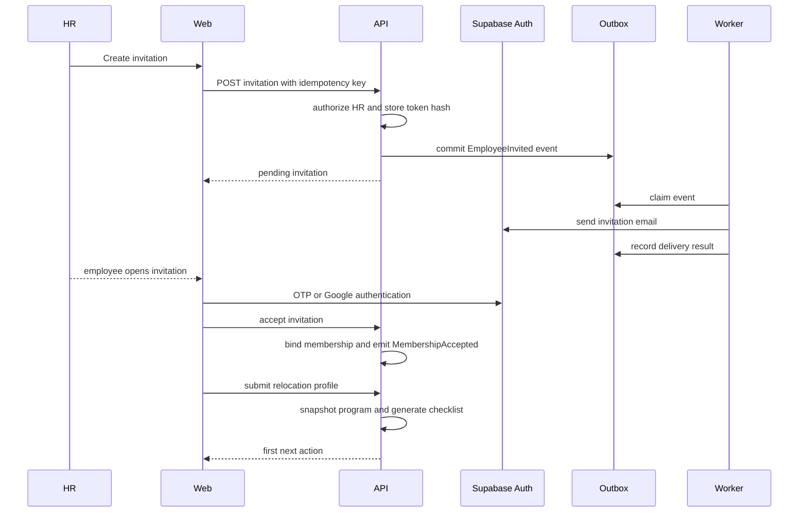

# Relo Full Platform Design

Status: architecture approved by the product owner on 28 September 2026.

This document turns the original Relo platform design, user flows, and event contracts into an implementation-ready plan for the full responsive platform. It preserves the product boundary while making the current prototype extensible.

## 1. Product outcome

Relo is a secure, employer-sponsored relocation platform. Employees receive one trusted workspace for preparing for a move. HR receives a low-touch operating surface for programs, invitations, progress, requests, and reports. Reviewers manage trusted city and provider content. Platform administrators manage tenants, access, security, delivery, and audit operations.

The primary product loop is AARRR:

| Loop | Product outcome | First measurable events |
| --- | --- | --- |
| Acquisition | An employer starts a workspace and invites a transferee | `TenantCreated`, `EmployeeInvited` |
| Activation | An employee accepts, completes a profile, and reaches a useful next action | `MembershipAccepted`, `RelocationCreated`, `FirstActionCompleted` |
| Retention | The employee returns and completes relocation steps | `ChecklistItemCompleted`, `SessionStarted`, `NotificationOpened` |
| Referral | Employees request trusted help and share qualified referrals | `ServiceRequestCreated`, `ReferralAccepted` |
| Revenue | The platform can report contracted usage and account health | `ProgramActivated`, `ActiveRelocationCount`, `ReportExported` |

Revenue metrics are reporting signals in V1. Payment processing, provider commissions, and billing automation are out of scope until commercial policy is approved.

## 2. Approved architecture

### Deployment units

The platform uses four independently deployable units:

1. `relo-web`: authenticated responsive web application and PWA shell.
2. `relo-api`: public API, authentication boundary, RBAC, domain modules, and synchronous workflows.
3. `relo-worker`: background processing for outbox events, notifications, reminders, report projections, and retries.
4. Supabase: Auth, Google OAuth, Postgres, RLS, and managed database operations.

The worker is intentionally separate from the API. Domain modules remain independently testable and have owned tables, contracts, and migration ownership. They can be extracted into network services later without changing the web contract.

### Why not six network services immediately

Six services would match the logical domain map but would add deployment, tracing, local development, secret, and failure-management overhead before product behavior is proven. The implementation therefore uses strict modular boundaries inside `relo-api`, an outbox, and versioned REST contracts. Extraction triggers are measured request volume, team ownership, isolation requirements, or independent scaling needs.

### Logical modules

| Module | Owns | Does not own |
| --- | --- | --- |
| Identity and tenancy | tenants, memberships, invitations, roles, access policy | relocation details, content, requests |
| Programs and relocation | programs, policy snapshots, relocation cases, profile, checklist | directory truth, provider delivery |
| Directory and content | cities, guides, providers, listings, provenance, revisions, moderation | employee private notes, HR progress |
| Requests and referrals | shortlists, requests, consent records, request transitions | provider catalog truth |
| Notifications | preferences, templates, delivery attempts, suppression, retries | business state |
| Reporting and AARRR | rebuildable projections, aggregates, metric definitions | source-of-truth writes |
| Operations | audit records, health signals, feature flags, support cases | tenant domain data |

No module imports another module's repositories or tables. Cross-module work uses application contracts or events.

## 3. Technology decisions

### Web

- React and TypeScript with Vite for a mobile-first SPA and PWA shell.
- TanStack Query for server state, request cancellation, retries, and cache invalidation.
- A small Relo component and token layer rather than a broad visual framework.
- Zod or generated JSON Schema validation at API boundaries.
- The existing `prototype/` remains the visual reference during migration and is retired only after parity tests pass.
- The web app never receives a service-role key.

### API and worker

- Node.js 22, TypeScript, Fastify, and explicit module registration.
- Zod or JSON Schema request validation.
- OpenAPI generated from route schemas.
- Supabase server clients for Auth and Postgres.
- Structured JSON logs with correlation and trace fields.
- The API and worker share only infrastructure-neutral contract packages. They do not share domain repositories or entities.

### Persistence and events

- One Supabase project with service-owned schemas or table namespaces during V1.
- RLS is enabled for every exposed table.
- A transactional outbox is written with every domain mutation that emits an event.
- `relo-worker` polls and locks pending outbox rows, publishes them to typed handlers, and records attempts and outcomes.
- The outbox adapter is replaceable with NATS JetStream when throughput or replay requirements justify a broker.
- Consumers are idempotent and store processed event IDs.

This gives loose coupling and replayable workflows without requiring a new broker deployment on the first day.

## 4. Authentication and authorization

### Authentication modes

- Email OTP through Supabase Auth and configured SMTP.
- Google sign-in through Supabase Auth social provider.
- Supabase OAuth Server remains a separate capability for third-party applications connecting to Relo. It is not the same as the Google sign-in button.
- Invitation acceptance binds an authenticated Supabase user to a pending tenant membership.

### Session boundary

The browser holds the provider session according to the Supabase browser pattern. The API validates the bearer token and resolves the Relo profile and memberships. The web app renders no protected dashboard until the API returns an authorized profile.

### Roles

| Role | Scope | Core permissions |
| --- | --- | --- |
| Employee | Own membership and relocation | profile, checklist, directory, shortlist, consented requests |
| HR | Tenant | programs, invitations, operational progress, request status, aggregate reports |
| Reviewer | Tenant or platform assignment | draft content, review, publish, expiry, revisions |
| Platform admin | Platform | tenants, roles, security, audit, health, feature flags |
| Support operator | Assigned support scope | support cases and redacted operational context |

Authorization is checked in the API module and repository boundary. A tenant ID supplied in a request body is never trusted.

## 5. User flows

### Employee invitation and activation



### Employee relocation flow

1. Open the invitation and authenticate.
2. Confirm origin, destination, office, move window, and required contact details.
3. Select optional preferences with a clear skip path.
4. Review the generated checklist.
5. Complete required actions before optional recommendations.
6. Browse only published, eligible, non-expired directory items.
7. Save items privately.
8. Submit a provider request with field-level consent.
9. Track request status and withdraw while the request is cancellable.
10. Manage notifications and privacy from settings.

### HR flow

1. Sign in and select a tenant if the user belongs to more than one.
2. Create or select a versioned relocation program.
3. Configure destination, move window, allowance policy, checklist, and content categories.
4. Invite employees with an idempotency key.
5. Monitor pending invitations and resend or revoke them.
6. Review aggregate progress and operational exceptions.
7. Open an employee's operational view without private notes by default.
8. Review request statuses required for support.
9. Export an allowed report. Every export is scoped, rate-limited, watermarked, and audited.

### Content review flow

```text
Draft -> validation -> reviewer decision -> immutable revision -> publish
   ^                                      |
   +------------ request changes --------+

Published -> freshness check -> re-verify or unpublish
```

### Settings flow

Every settings surface uses explicit save states, dirty-form protection, validation, and audit behavior.

Employee settings:

- profile and preferred contact method
- notification channels and frequency
- privacy and provider-sharing defaults
- active sessions
- data export request
- account deactivation request

HR settings:

- organization profile and timezone
- membership and role assignments
- invitation defaults
- program defaults
- reporting and export permissions
- notification templates and sender identity reference
- integration status

Reviewer settings:

- assigned cities and categories
- review policy references
- review queue preferences
- notification preferences

Platform settings:

- tenant lifecycle
- feature flags
- auth and session policy references
- service health
- audit access
- incident and support configuration

## 6. Web information architecture

### Unauthenticated

- `/login`
- `/verify`
- `/invite/:token`
- `/oauth/consent`
- `/privacy`
- `/terms`
- `/status`

### Employee

- `/app`
- `/app/onboarding`
- `/app/checklist`
- `/app/explore`
- `/app/saved`
- `/app/requests`
- `/app/profile`
- `/app/notifications`
- `/app/settings`

### HR

- `/hr`
- `/hr/employees`
- `/hr/employees/:id`
- `/hr/invitations`
- `/hr/programs`
- `/hr/programs/:id`
- `/hr/requests`
- `/hr/reports`
- `/hr/settings`

### Reviewer and platform administration

- `/review`
- `/review/queue`
- `/review/content`
- `/review/cities`
- `/review/providers`
- `/review/audit`
- `/admin`
- `/admin/tenants`
- `/admin/users`
- `/admin/security`
- `/admin/health`
- `/admin/settings`

Every route has loading, empty, stale, error, permission-denied, and retry states. Mobile navigation exposes the five most important destinations and moves secondary actions into a sheet.

## 7. Data ownership

### Identity schema

- `tenants`
- `memberships`
- `invitations`
- `roles`
- `role_permissions`
- `active_sessions`

### Relocation schema

- `programs`
- `program_versions`
- `relocations`
- `relocation_profiles`
- `checklist_items`
- `checklist_transitions`

### Directory schema

- `cities`
- `providers`
- `directory_items`
- `content_revisions`
- `provenance_records`
- `moderation_decisions`

### Request schema

- `shortlist_items`
- `service_requests`
- `consent_records`
- `request_transitions`

### Notification schema

- `notification_preferences`
- `templates`
- `delivery_attempts`
- `suppression_entries`

### Reporting schema

- `outbox_events`
- `processed_events`
- `aarrr_daily_metrics`
- `tenant_progress_projection`
- `export_jobs`

### Operations schema

- `audit_log`
- `support_cases`
- `feature_flags`
- `service_incidents`

Cross-domain references use stable IDs and contracts. Cross-domain foreign keys are avoided so a module can be extracted later.

## 8. API contract

All new endpoints use `/api/v1`. Existing `/api` endpoints remain as compatibility shims during migration and are removed only after the web migration and contract tests are complete.

Required headers:

- `Authorization: Bearer ...`
- `X-Correlation-Id`
- `Idempotency-Key` on invitation, creation, request, export, and other retry-sensitive mutations

Core endpoint groups:

```text
GET    /api/v1/me
GET    /api/v1/tenants
POST   /api/v1/tenants/{tenantId}/invitations
POST   /api/v1/invitations/{token}/accept

GET    /api/v1/relocations
POST   /api/v1/relocations
GET    /api/v1/relocations/{id}
PATCH  /api/v1/relocations/{id}/profile
GET    /api/v1/relocations/{id}/checklist
POST   /api/v1/relocations/{id}/checklist/{itemId}/complete

GET    /api/v1/directory/items
GET    /api/v1/directory/items/{id}
POST   /api/v1/directory/items/{id}/shortlist
DELETE /api/v1/directory/items/{id}/shortlist

POST   /api/v1/relocations/{id}/requests
GET    /api/v1/relocations/{id}/requests
POST   /api/v1/requests/{id}/cancel

GET    /api/v1/hr/dashboard
GET    /api/v1/hr/employees
GET    /api/v1/hr/reports
POST   /api/v1/hr/reports/exports

GET    /api/v1/reviewer/queue
POST   /api/v1/reviewer/content/{id}/approve
POST   /api/v1/reviewer/content/{id}/reject
POST   /api/v1/reviewer/content/{id}/publish

GET    /api/v1/admin/events
GET    /api/v1/admin/health
PATCH  /api/v1/admin/feature-flags/{key}
```

Errors use stable codes and correlation IDs:

```json
{
  "error": {
    "code": "REQUEST_ALREADY_EXISTS",
    "message": "A request for this item is already open.",
    "correlationId": "c_01J...",
    "details": {}
  }
}
```

## 9. Event contract

Every event contains:

```json
{
  "eventId": "evt_01J...",
  "eventType": "ServiceRequestCreated",
  "eventVersion": 1,
  "occurredAt": "2026-09-28T10:30:00Z",
  "tenantId": "ten_01J...",
  "aggregateType": "service_request",
  "aggregateId": "req_01J...",
  "correlationId": "c_01J...",
  "causationId": "cmd_01J...",
  "dataClassification": "confidential",
  "payload": {}
}
```

Initial events:

`TenantCreated`, `EmployeeInvited`, `MembershipAccepted`, `RelocationCreated`, `FirstActionCompleted`, `ChecklistItemCompleted`, `ItemShortlisted`, `ServiceRequestCreated`, `ServiceRequestStatusChanged`, `ContentPublished`, `NotificationDeliveryChanged`, `ReportExported`.

Events contain IDs and minimal metadata. Free text, secrets, tokens, and unnecessary profile fields are never emitted.

## 10. Security, privacy, and reliability

- RLS on every exposed table.
- API authorization at route, module, and query boundaries.
- No service-role key in the browser, repository, or container image.
- Google client secret configured only in Supabase Auth or Render secret storage.
- Rate limiting on OTP, invitation, search, request, export, and admin endpoints.
- Input schemas and bounded filters on every endpoint.
- CSRF protection if cookies are used for mutations.
- Secure headers and a restrictive Content Security Policy.
- Audit logging for role changes, invitations, consent, request transitions, publishing, exports, and feature changes.
- Idempotent mutations and outbox writes in the same transaction as business state.
- Retry with backoff and dead-letter state for worker failures.
- Structured logs with redacted personal data.
- Liveness and readiness endpoints for API and worker.
- Encrypted backups and a tested restore runbook.
- Accessibility target: WCAG 2.2 AA.

## 11. Implementation phases

### Phase 1: Foundation

- Create typed web and API workspace structure.
- Add `/api/v1` contract layer and correlation IDs.
- Add SQL migration conventions and service ownership documentation.
- Add outbox and worker skeleton.
- Add CI for type checks, tests, secret scanning, and container scanning.

### Phase 2: Identity and tenancy

- Complete OTP and Google login.
- Add tenant memberships, invitation lifecycle, role matrix, and tenant selection.
- Add admin user provisioning and invitation audit.
- Add profile existence enforcement.

### Phase 3: Employee activation

- Add program versions, relocation profile, preferences, and checklist generation.
- Add mobile onboarding flow with resume support.
- Emit activation and checklist events.

### Phase 4: Directory and requests

- Add cities, providers, guides, provenance, revisions, moderation, expiry, search, shortlist, request, consent, and withdrawal.
- Add notification event handlers.

### Phase 5: HR and AARRR operations

- Add HR dashboard, employees, programs, request operations, reports, exports, and AARRR projections.
- Add privacy-minimized employee detail views.

### Phase 6: Reviewer and platform administration

- Add review queue, publishing, audit, tenant operations, security events, health, settings, and feature flags.

### Phase 7: Hardening and delivery

- Add E2E, accessibility, tenant isolation, authorization matrix, replay, retry, load, backup, rollback, and incident tests.
- Deploy frontend, API, and worker independently on Render.

## 12. Acceptance criteria

The platform is ready for the first production pilot when:

- HR can configure a program and invite an employee.
- Employees can authenticate with OTP or Google, accept an invitation, and complete onboarding.
- Program changes do not alter existing relocation policy snapshots.
- Checklist transitions are authorized, idempotent, and tenant isolated.
- Directory search returns only published, eligible, non-expired items.
- Shortlists remain private to the employee.
- Provider requests record field-level consent and prevent duplicates.
- HR sees aggregate progress and operational request states without private notes by default.
- Reviewers can publish and expire content with an audit trail.
- Notifications retry without duplicating business actions.
- Reporting projections can be rebuilt from events.
- Admin and settings actions are permissioned and audited.
- All protected dashboards are inaccessible while logged out.
- Critical flows pass responsive, keyboard, accessibility, and tenant-isolation tests.
- The API, worker, and web service expose health status and structured operational signals.

## 13. Deferred scope

- Native iOS and Android applications.
- Payment processing and provider payouts.
- Lease execution or legal advice.
- Real-time provider chat.
- Public provider self-service onboarding.
- Advanced recommendation machine learning.
- HRIS replacement functionality.
- Employee document uploads until retention and compliance policy is approved.
